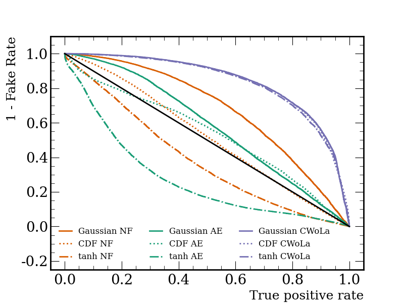

# Anomaly Detection under Coordinate Transformations
In this repository, the implementation of the studies presented in the paper: Anomaly Detection under Coordinate Transformations is preseented.


[Tensorflow 2.6.0](https://www.tensorflow.org/) was used to implement all models




Gaussian example:

To train both unsupervised and weakly-supervised models starting from Gaussian distributions with::

```bash
python gaussian.py 
```

To produce the ROC curve used to investigate the performance of the methods run:

```bash
python plot_gaussian.py
```

Anomaly detection using the LHCO dataset is done with:

```bash
python lhco.py
```

with plot of the results similarly created using:

```bash
python plot_lhco.py
```
